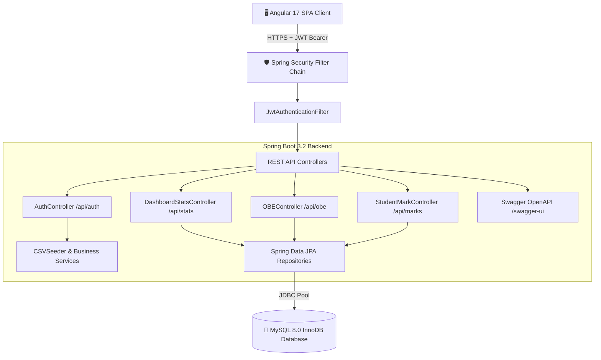

# 🎓 OBLMS - Enterprise Outcome-Based Learning Management System

[](https://spring.io/projects/spring-boot)
[](https://angular.dev/)
[](https://www.mysql.com/)
[](https://jwt.io/)
[](http://localhost:8080/swagger-ui.html)
[](https://www.docker.com/)

> **OBLMS (Outcome-Based Learning Management System)** is an enterprise educational and accreditation platform engineered to fulfill **NBA (National Board of Accreditation)** and **NAAC** Tier-1 requirements. It features real-time **Course Outcomes (CO1-CO5)** tracking, **Bloom's Taxonomy** cognitive mapping, **Program Outcomes (PO1-PO12)** 12-axis radar visualization, multi-semester student grade memos, continuous internal evaluation (CIE), and secure JWT role-based access.

---

## 🏛️ System Architecture



---

## ✨ Key Enterprise Capabilities

1. **🛡️ Enterprise Spring Security & JWT**:
   - 256-bit HMAC-SHA256 encrypted JWT Bearer tokens with 24-hour validity.
   - Stateless session management, BCrypt password hashing, and Angular Functional Route Guards (`canActivate: [RoleGuard]`).
   
2. **🕸️ 12-Axis NBA Program Outcomes (PO1-PO12) Radar / Spider Chart**:
   - Concentric target vs. attained SVG radar articulation showcasing graduate attribute attainment across all engineering disciplines.

3. **📄 Historical Multi-Semester Grade Cards (Semesters 1 - 6)**:
   - Dynamic SGPA calculations, total earned credits, letter grades (`O`, `A+`, `A`), CIE internals (/30), SEE externals (/100), and 1-click CSV Grade Memo downloads.

4. **🎯 Bloom's Taxonomy & CO-PO Correlation Matrix**:
   - 349 active Course Outcomes across 6 cognitive levels (Remember, Understand, Apply, Analyze, Evaluate, Create).
   - 768 accredited CO-PO correlations with automated 75% benchmark threshold analytics.

5. **📑 Interactive OpenAPI 3.0 / Swagger UI**:
   - Live interactive documentation at `http://localhost:8080/swagger-ui.html` with built-in JWT authorization.

---

## 🔑 Demo Login Credentials (47 Master Accounts)

| Role | Email / User ID | Password | Department / Description |
| :--- | :--- | :--- | :--- |
| **Admin** | `admin@oblms.edu` / `ADM001` | `root` | Chief Academic Administrator & Dean |
| **Faculty (CSE)** | `ramesh.babu@oblms.edu` / `FAC001` | `password` | Dr. Ramesh Babu (5 Courses Allotted) |
| **Faculty (ECE)** | `amit.patel@oblms.edu` / `FAC003` | `password` | Dr. Amit Patel (5 Courses Allotted) |
| **Faculty (Civil)** | `priya.nair@oblms.edu` / `FAC004` | `password` | Dr. Priya Nair (5 Courses Allotted) |
| **Faculty (ME)** | `rajesh.verma@oblms.edu` / `FAC005` | `password` | Prof. Rajesh Verma (5 Courses Allotted) |
| **Student (CSE)** | `krishnavamsi@gmail.com` / `STU004` | `password` | Krishnavamsi (Sem 6 • B.Tech CSE) |
| **Student (IT)** | `rahul.dravid@oblms.edu` / `STU006` | `password` | Rahul Dravid (Sem 6 • B.Tech IT) |
| **Student (ECE)** | `pooja.hegde@oblms.edu` / `STU011` | `password` | Pooja Hegde (Sem 6 • B.Tech ECE) |
| **Student (ME)** | `megha.sundaram@oblms.edu` / `STU016` | `password` | Megha Sundaram (Sem 6 • B.Tech ME) |
| **Student (Civil)**| `karthik.aryan@oblms.edu` / `STU021` | `password` | Karthik Aryan (Sem 6 • B.Tech Civil) |

---

## 🚀 Quick Start & Deployment

### Option A: Standard Local Setup
```bash
# 1. Start MySQL (Port 3306) with database 'oblms'

# 2. Start Spring Boot Backend
cd springboot-backend
mvn clean package -DskipTests
java -jar target/backend-0.0.1-SNAPSHOT.jar

# 3. Start Angular Frontend (Port 4200)
cd outcome-based-lms
npm install
npm start
```

### Option B: Docker Multi-Container Orchestration
```bash
# Build and launch MySQL, Spring Boot backend, and Angular frontend
docker-compose up -d --build

# Access Application:
# Frontend:   http://localhost:4200
# Backend:    http://localhost:8080
# Swagger UI: http://localhost:8080/swagger-ui.html
```

---

## 🧪 Automated Testing

```bash
cd springboot-backend
mvn test
```
- **AttainmentCalculationTest**: Verifies NBA 75% threshold rules and SGPA grade point algorithms.
- **JwtTokenProviderTest**: Validates HMAC-SHA256 signature generation, tampering prevention, and claims extraction.
